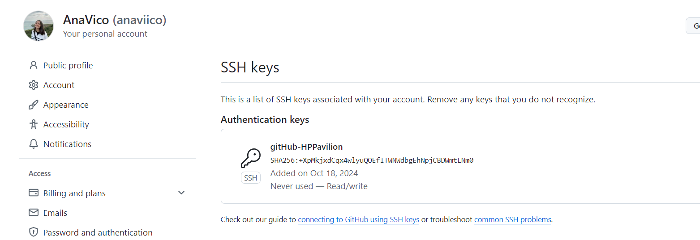

# Configuración de Git y GitHub

## Configuración de mi perfil de GitHub

He personalizado mi perfil de GitHub añadiendo una imagen distintiva y completando toda la información personal relevante. Esto ayuda a identificarme  dentro de la comunidad de desarrolladores (clase de CC).

## Autenticación en dos pasos

Para mejorar la seguridad, he activado la autenticación en dos pasos. Esto asegura que solo yo pueda acceder al repositorio y a mi cuenta asociada, incluso si las credenciales iniciales son comprometidas.

## Configuración de la clave SSH

He configurado correctamente una clave SSH para realizar conexiones seguras con GitHub. Esto me permite interactuar con el repositorio sin la necesidad de introducir las credenciales manualmente en cada operación.

## Uso de Sourcetree para Commits y Push

**Sourcetree** es una herramienta gráfica que utilizo para gestionar repositorios Git, facilitando la realización de commits, push y otras operaciones sin necesidad de usar la línea de comandos. Para configurar **Sourcetree** y conectarlo con mi repositorio de GitHub, sigo estos pasos:

1. **Instalación y configuración inicial**: Descargué e instalé **Sourcetree** desde [el sitio oficial](https://www.sourcetreeapp.com/). Durante la instalación, conecté mi cuenta de GitHub.
   
2. **Clonar mi repositorio**: Una vez iniciada la sesión, cloné mi repositorio de GitHub directamente desde Sourcetree seleccionando la opción "Clone" y proporcionando la [URL del repositorio](https://github.com/anaviico/QuizWiz/tree/main).

3. **Configuración de SSH en Sourcetree**: 
   - Abrí **Sourcetree** y fui a las preferencias de Git.
   - Configuré mi clave SSH, asegurándome de que esté correctamente configurada. Sourcetree utiliza esta clave SSH para conectar de forma segura con GitHub.

4. **Realización de commits**:
   - Después de realizar cambios en mi proyecto, selecciono los archivos modificados en Sourcetree, añado un mensaje de commit descriptivo, y hago clic en "Commit" para registrar los cambios localmente.

5. **Push de cambios**:
   - Para subir mis cambios al repositorio remoto, selecciono la opción "Push" en Sourcetree. Esto envía los commits locales a mi repositorio de GitHub.

**Sourcetree** simplifica la gestión de repositorios Git, haciendo más intuitivo el proceso de commits y push.

