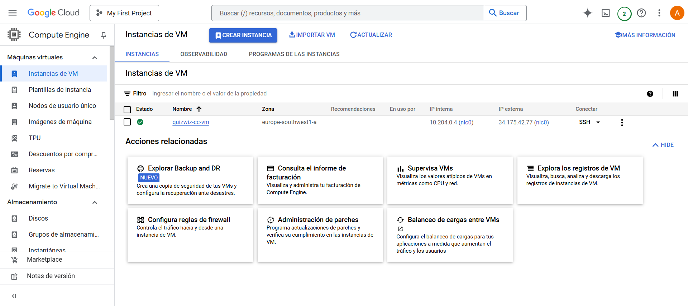
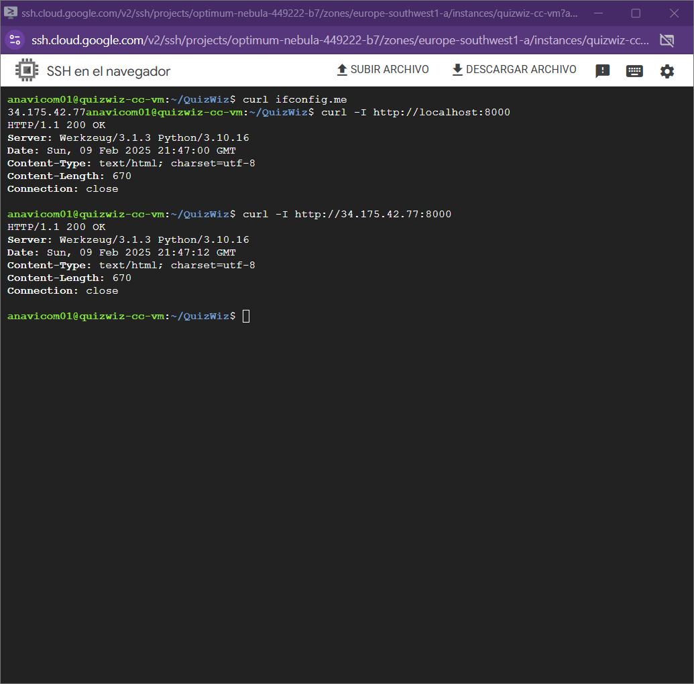
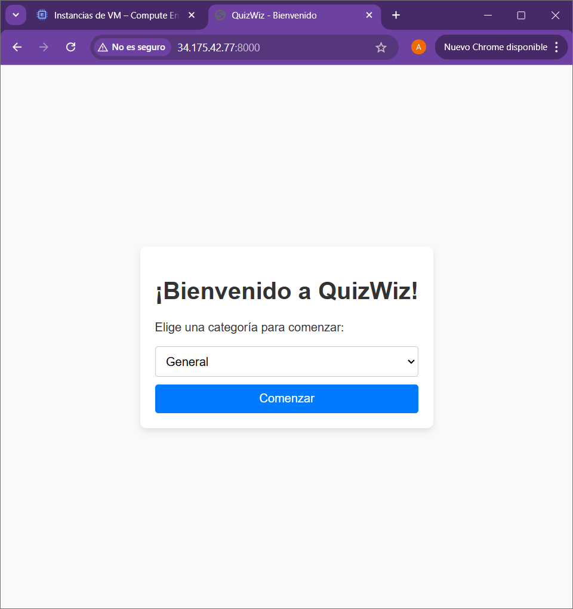

# Hito 5: Despliegue de la Aplicación en un PaaS

## 🎯 Introducción y Objetivos

En este hito se ha logrado el **despliegue de QuizWiz en la nube** utilizando **Google Cloud Compute Engine**. Esto ha permitido que la aplicación esté disponible desde cualquier lugar sin necesidad de ejecutarla localmente.

Los objetivos de este hito fueron:

- Evaluar distintas plataformas para elegir la mejor opción.
- Configurar un **entorno en Google Cloud** que permita ejecutar la aplicación.
- Asegurar la **persistencia de datos** mediante PostgreSQL en un contenedor.
- **Solucionar problemas de red y firewall** para hacer accesible la aplicación.
- Automatizar el despliegue con **Docker Compose** y SSH desde GitHub.

---

## 🔍 Comparativa de Plataformas PaaS/IaaS

Antes de elegir Google Cloud, se analizaron varias opciones:

| Plataforma | Ventajas | Desventajas |
|------------|---------|-------------|
| **Render** | Fácil integración con GitHub, configuración sencilla | No soporta `docker-compose`, problemas con bases de datos |
| **Railway** | Interfaz intuitiva, buen soporte para contenedores | Limitaciones de memoria en la versión gratuita |
| **Fly.io** | Despliegue geodistribuido | No soporta `docker-compose` |
| **Google Cloud Compute Engine** | Control total, permite Docker y PostgreSQL, créditos gratuitos | Configuración inicial más compleja |

### 🎯 **Decisión: Google Cloud Compute Engine**
Se eligió **Google Cloud** porque:
1. **Permite usar Docker Compose**, facilitando el despliegue.
2. **Ofrece créditos gratuitos** suficientes para el proyecto.
3. **Tiene control total sobre la máquina virtual** y el sistema operativo.
4. **Facilita la integración con GitHub Actions** para futuras automatizaciones.
5. **Soporta PostgreSQL sin problemas**, a diferencia de otras plataformas.

---

## 🚀 Proceso de Creación y Despliegue

### 1️⃣ **Creación de la Máquina Virtual**
1. Se accede a [Google Cloud Console](https://console.cloud.google.com/).
2. En **Compute Engine > Instancias de VM** (con una cuenta iniciada) se crea una nueva instancia.
3. Configuración:
   - **Nombre:** `quizwiz-cc-vm`
   - **Región:** Europa (Madrid)
   - **Tipo de máquina:** `e2-medium` (2 vCPUs, 4GB RAM)
   - **Disco:** 20GB, sistema operativo **Debian**
   - **Red:** Asegurar acceso a Internet.

4. Una vez creada se utiliza ssh.




### 2️⃣ **Instalación de Dependencias**
En la máquina virtual mediante el ssh:
```bash
sudo apt update && sudo apt upgrade -y
sudo apt install -y docker.io docker-compose git
```

Clonamos el repositorio:
```bash
git clone https://github.com/anaviico/QuizWiz.git
cd QuizWiz
```

### 3️⃣ **Desplegar la Aplicación con Docker**
Creamos los contenedores:
```bash
sudo docker-compose up -d --build
```

Verificamos que todo esté corriendo:
```bash
sudo docker ps
```

### 4️⃣ **Abrir el Firewall**
Uno de los principales problemas fue que la aplicación no era accesible desde el navegador. Esto se solucionó con:
```bash
gcloud compute firewall-rules create allow-quizwiz \
    --allow=tcp:8000 \
    --source-ranges=0.0.0.0/0 \
    --target-tags=quizwiz-app
```

Se verificó que los puertos estuvieran abiertos:
```bash
gcloud compute firewall-rules list
```

### 5️⃣ **Pruebas de Conectividad**
- Dentro de la VM:
  ```bash
  curl -I http://localhost:8000
  ```
- Desde el PC, utilizando la IP pública de la VM, 34.175.42.77:
  ```bash
  curl -I http://34.175.42.77:8000
  ```

---

## ⚠️ **Problemas Encontrados y Soluciones**

| **Problema** | **Solución** |
|--------------|-------------|
| `Connection timed out` al acceder a la app | Falta de reglas de firewall. Se creó la regla `allow-quizwiz`. |
| Docker no encontraba `requirements.txt` | Se corrigió la ruta en `Dockerfile`. |
| No se podía conectar a la BD | Se verificó `DATABASE_URL` y se ejecutó `init_bd.py`. |
| `Port already in use` al reiniciar la app | Se aseguraron contenedores activos con `docker ps`. |

---

## 📸 **Muestra de Ejecución**

**Aplicación corriendo en la VM**  


**Acceso desde el navegador**  


---

## ✅ **Conclusión**

- Se ha desplegado correctamente **QuizWiz en Google Cloud**.
- Se resolvieron problemas de red, firewall y configuración de contenedores.
- La app ahora es **accesible desde cualquier dispositivo**.


